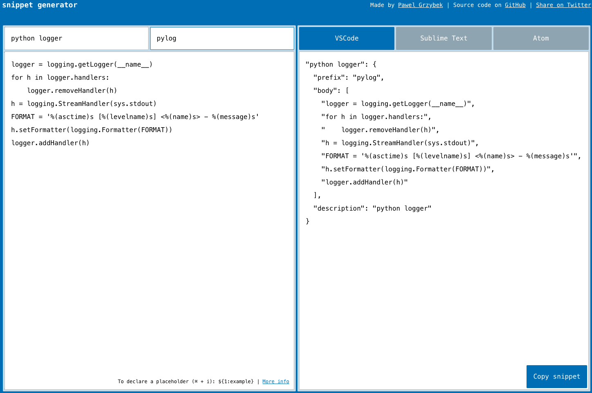
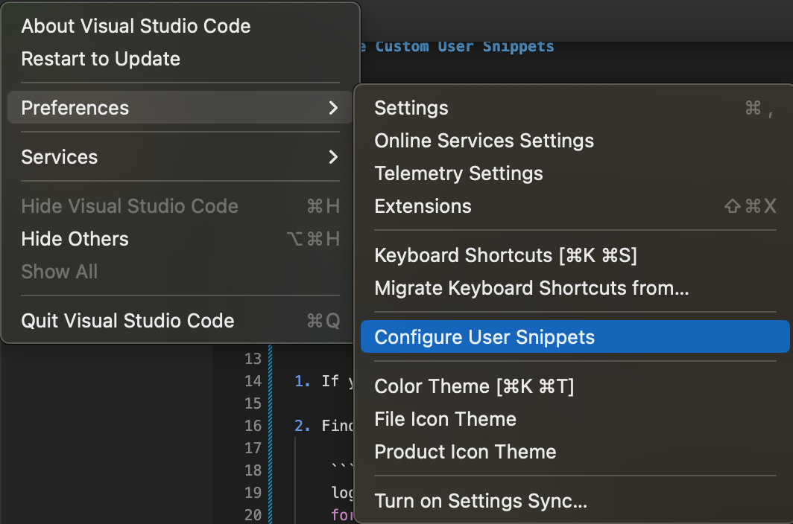
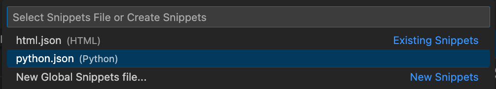
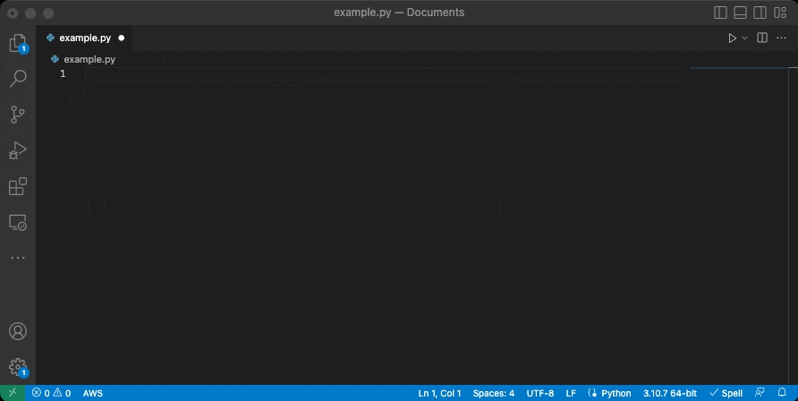

# VSCode Custom User Snippets

[](https://github.com/rearc/vscode-custom-user-snippets/blob/main/LICENSE)

This repository hosts a collection of useful custom user snippets for Visual Studio Code.

Custom User Snippets are feature of VSCode that associates code templates with designated aliases (*prefix tab triggers*). Upon invocation of the snippet's alias the snippet's code is inserted at the cursor's location within the editor's current active file.

For more information on the creation and usage of Custom User Snippets, see the official [Snippets in Visual Studio Code](ttps://code.visualstudio.com/docs/editor/userdefinedsnippets)
documentation.

<br/>

## Getting Started
To use the snippets from the collection, select the snippets listed under the repository's [`snippets/`](./snippets/) directory or the list below, and follow the associated documentation for installation and use.

|Snippet|Description|
|---|:--|
|[Python3 Parameterized Script](./snippets/python3-parameterized-script/README.md)| Provides boilerplate code for creating a parameterized script using argparse. Provides a default logger tied to an argparse argument for setting log level|
|[Simple README](./snippets/markdown-basic-readme/README.md)| Provides boilerplate code for quickly generating a simple generic README for documentation purposes.|

<br/>

## Creating Custom User Snippets

1. If you don't already have it installed, install the Visual Studio Code editor: https://code.visualstudio.com

2. Find some code you would like to turn into a snippet:

    ```python
    logger = logging.getLogger(__name__)
    for h in logger.handlers:
        logger.removeHandler(h)
    h = logging.StreamHandler(sys.stdout)
    FORMAT = '%(asctime)s [%(levelname)s] <%(name)s> - %(message)s'
    h.setFormatter(logging.Formatter(FORMAT))
    logger.addHandler(h)
    ```

3. Go to the [Snippet Generator App](https://snippet-generator.app/), ensure VSCode is selected from the available options, and paste the contents of your code in the `Your snippet...` field. Add a `Description` and `Tab trigger`.

    

4. Click the "`Copy snippet`" button in the bottom-right corner of the screen.

5. From VSCode Preferences select the `Custom User Snippets` option, and choose the appropriate snippet configuration file for the language you are using, or select a Global Snippets file:


    
    

6. Paste the contents of your snippet into the configuration file and save:

    Example contents of the `python.json` configuration file:
    ```json
    {
        "python logger": {
            "prefix": "pylog",
            "body": [
                "logger = logging.getLogger(__name__)",
                "for h in logger.handlers:",
                "    logger.removeHandler(h)",
                "h = logging.StreamHandler(sys.stdout)",
                "FORMAT = '%(asctime)s [%(levelname)s] <%(name)s> - %(message)s'",
                "h.setFormatter(logging.Formatter(FORMAT))",
                "logger.addHandler(h)"
            ],
            "description": "python logger"
        }
    }    
    ```

7. Test your snippet by opening a new file/document, typing the prefix trigger, and hitting the <TAB> key to insert the snippet contents.


    

<br/>

## Contributing
For contributing new custom user snippets to those found here, see the [CONTRIBUTING](./.github/CONTRIBUTING.md) documentation.

<br/>

## Reference Documentation
* User Defined Snippets in VSCode: https://code.visualstudio.com/docs/editor/userdefinedsnippets
* Snippet Generator App: https://snippet-generator.app/