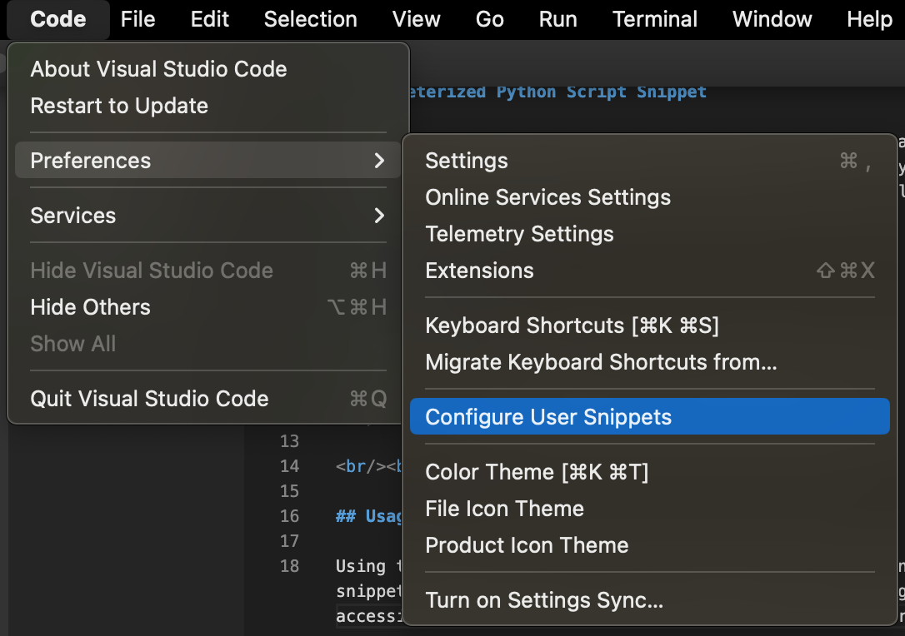
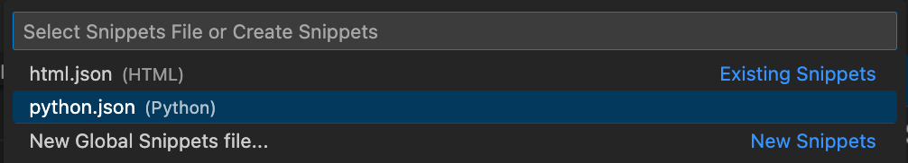

# Parameterized Python Script Snippet

This snippet generates boilerplate code for creating a parameterized Python3 script. The script leverages the [argparse](https://docs.python.org/3/library/argparse.html) library for parameterization and comes with a preconfigured logger, and an associated argparse argument for overriding the default log level of `INFO`.

<br/><br/>

## Prerequisites

This snippet's dependencies are an up-to-date version of VSCode and the Python3 runtime:

* Install VSCode: https://code.visualstudio.com
* Python 3: https://realpython.com/installing-python/

<br/><br/>

## Usage

Using the snippet requires copying the contents of the snippet.json file and pasting them into either the `python.json` snippet configuration file, or the global snippets configuration file in VSCode. The user snippets configuration files are accessible via VSCode `Preferences` under the `Configure User Snippets` option.

<br/>



<br/>



<br/>

Paste the contents of the `snippet.json` file into the configuration file and save.

Example:

```json
{
	// Place your snippets for python here. Each snippet is defined under a snippet name and has a prefix, body and 
	// description. The prefix is what is used to trigger the snippet and the body will be expanded and inserted. Possible variables are:
	// $1, $2 for tab stops, $0 for the final cursor position, and ${1:label}, ${2:another} for placeholders. Placeholders with the 
	// same ids are connected.
	// Example:
	// "Print to console": {
	// 	"prefix": "log",
	// 	"body": [
	// 		"console.log('$1');",
	// 		"$2"
	// 	],
	// 	"description": "Log output to console"
	// }
	"Python3 Parameterized Script": {
		"prefix": "pyscript",
		"body": [
		  "#!/usr/bin/env python3",
		  "\"\"\"${1:script_name}",
		  "",
		  "${2:script_description}",
		  "",
		  "Functions",
		  "---------",
		  "get_arguments() - returns argparse.ArgumentParser object with script args",
		  "",
		  "main() - the script's main function",
		  "\"\"\"",
		  "import argparse",
		  "import logging",
		  "import sys",
		  "",
		  "logger = logging.getLogger(__name__)",
		  "for h in logger.handlers:",
		  "    logger.removeHandler(h)",
		  "h = logging.StreamHandler(sys.stdout)",
		  "FORMAT = '%(asctime)s [%(levelname)s] <%(name)s> - %(message)s'",
		  "h.setFormatter(logging.Formatter(FORMAT))",
		  "logger.addHandler(h)",
		  "",
		  "",
		  "def get_arguments() -> argparse.ArgumentParser:",
		  "    \"\"\"Creates an argparse parser for simplifying parameterization of",
		  "    the script and argument management",
		  "",
		  "    Returns",
		  "    -------",
		  "    arguments: argparse.ArgumentParser",
		  "        an argparse parser object with a set of parsed arguments",
		  "    \"\"\"",
		  "    try:",
		  "        parser = argparse.ArgumentParser(usage='%(prog)s --log_level DEBUG')",
		  "        parser.add_argument(",
		  "            \"-l\",",
		  "            \"--log_level\",",
		  "            default=\"INFO\",",
		  "            help=\"Used to explicitly set the Log Level (Default: INFO)\"",
		  "        )",
		  "        arguments = parser.parse_args()",
		  "        return arguments",
		  "    except Exception:",
		  "        logger.exception(\"Error accessing arguments!\")",
		  "",
		  "",
		  "def main():",
		  "    arguments = get_arguments()",
		  "    logger.setLevel(arguments.log_level)",
		  ""
		],
		"description": "Python3 Parameterized Script"
	  }
}
```

<br/>

You can now test the snippet by creating any file in VSCode with the `.py` extension, typing the `pyscript` prefix trigger, and hitting `<TAB>` to insert your snippet's code at the current position of the cursor. Once the snippet has populated code into your file it will immediately reposition your cursor at the snippet's first placeholder position. Advance through each placeholder by entering content and/or hitting the `<TAB>` key.

<br/><br/>

## Reference Documentation
* Argparse Library: https://docs.python.org/3/library/argparse.html
* User Defined Snippets in VSCode: https://code.visualstudio.com/docs/editor/userdefinedsnippets
* VSCode Snippet Placeholders: https://code.visualstudio.com/docs/editor/userdefinedsnippets#_placeholders
